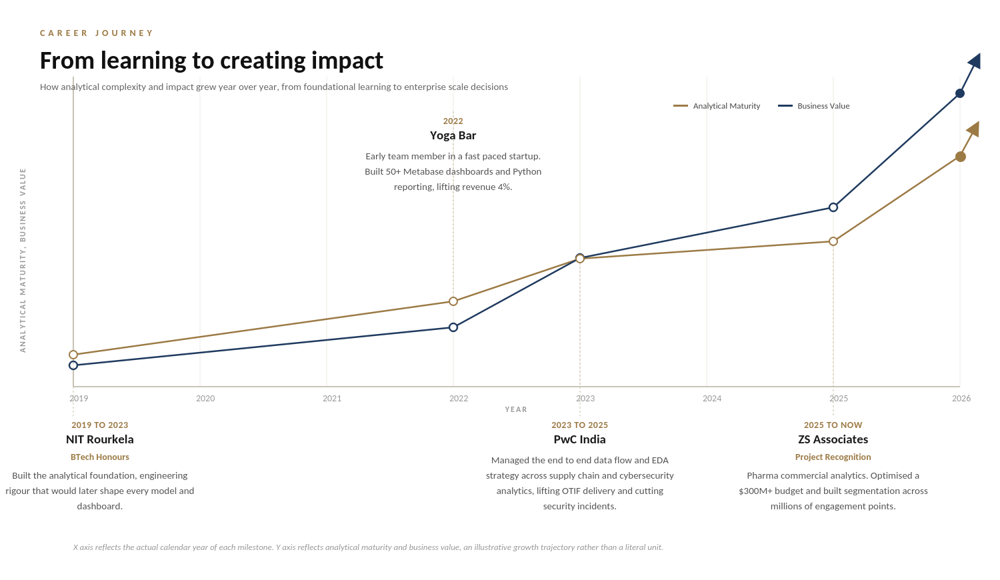
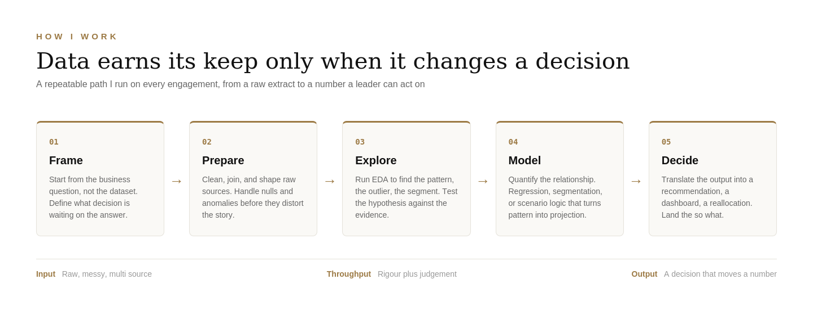
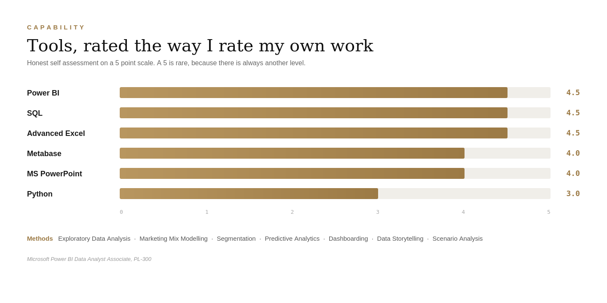
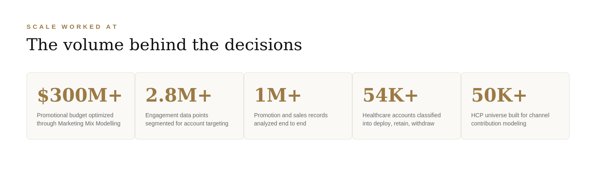
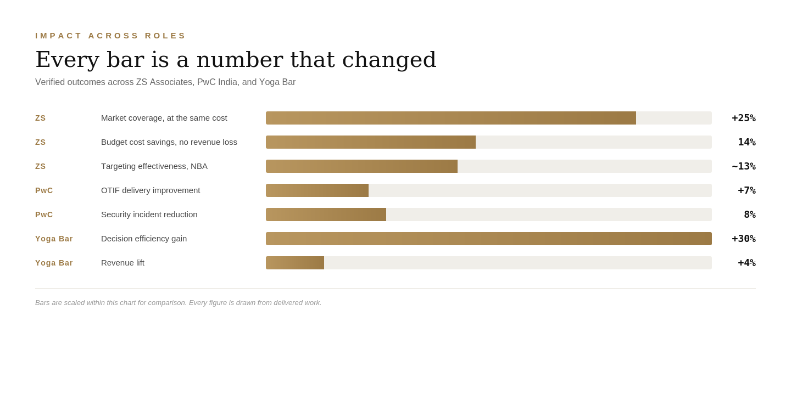

# Data-analyst-and-strategy-consultant

# Sakti Swarup Mohapatra

### Data Analyst and Strategy Consultant

Turning complex data into decisions that move real numbers

Bengaluru, India

[GitHub](https://github.com/mohapatrasakti04) • [LinkedIn](https://www.linkedin.com/in/mohapatrasakti/) • mohapatrasakti04@gmail.com

---

## The one line version

Three plus years across analytics and strategy consulting, spanning pharma commercial analytics, supply chain optimization, and business intelligence. I work where the data ends and the decision begins.

---

## Career journey

---

## How I think about data

A dashboard is not the deliverable. The decision it drives is. I run this path on every engagement, and it is why the work below ends in numbers that changed rather than charts that impressed.

---

## Skills

---

## Professional experience

### ZS Associates, Analytics Associate, Analytics and Strategy
**2025 to Present, Bengaluru**

Owning end to end commercial analytics engagements for pharmaceutical clients across targeting, marketing effectiveness, budget optimization, and strategy.

- Optimized a $300M+ FY27 promotional budget for 14% cost savings with no revenue impact, reallocating spend toward higher ROI and mROI channels
- Built an HCP universe of 50K+ professionals and ran Marketing Mix Modelling across 10+ channels using adstock modeling and linear regression
- Analyzed 54K+ accounts, 380K+ prescription and claims records, and 2.8M+ engagement data points to build a multi factor segmentation framework, lifting market coverage 25% at the same cost
- Designed 20+ Next Best Action use cases across Claims, Hub, Specialty Pharmacy, and DDD datasets, improving targeting effectiveness by roughly 13%

### PwC India, Associate Consultant, One Consulting
**2023 to 2025, Kolkata**

- Built a replenishment based inventory optimization model for the West Bengal Public Distribution System, improving OTIF delivery 7% across the network
- Deployed Power BI dashboards across 50+ warehouses and every district in the state for centralized inventory and supply monitoring
- Led a 2 analyst team running 25+ Power BI dashboards for global security operations, reducing security incidents 8%

### Yoga Bar, Business Analyst Intern
**2022, Bengaluru**

- Joined as an early team member in a fast paced startup, owning work across functions
- Used sales and P&L analysis to trace revenue leakage to churn and stockouts, driving initiatives that raised revenue 4%
- Built 50+ Metabase dashboards and automated reporting in Python, improving decision efficiency 30%

---

## Scale worked at

---

## Impact across roles

---

## Featured work on GitHub

Public case studies where the full reasoning is on show, from raw data to recommendation.

<table>
<tr>
<td width="130"></td>
<td><b><a href="https://github.com/mohapatrasakti04/IPL-Dashboard">IPL Analytics Dashboard</a></b> 18 seasons of cricket modeled as a star schema in Power BI, from ball by ball data to a season aware dashboard.</td>
</tr>
<tr>
<td></td>
<td><b><a href="https://github.com/mohapatrasakti04/Quiet-Monetization-of-Convenience">Quiet Monetization of Convenience</a></b> How Zomato and Swiggy turned a small platform fee into a large revenue engine inside a duopoly.</td>
</tr>
<tr>
<td></td>
<td><b><a href="https://github.com/mohapatrasakti04/UPI-Transaction-Charge-Debate">UPI Transaction Charge Debate</a></b> The economics of who really pays when payments are free.</td>
</tr>
<tr>
<td></td>
<td><b><a href="https://github.com/mohapatrasakti04/India-Heritage-Tourism-Insights">India Heritage Tourism Insights</a></b> Demand concentration and untapped opportunity across ASI monuments.</td>
</tr>
<tr>
<td></td>
<td><b><a href="https://github.com/mohapatrasakti04/KPMG-Virtual-Internship">KPMG Virtual Internship</a></b> Customer segmentation and RFM analysis for a cycling retailer.</td>
</tr>
<tr>
<td></td>
<td><b><a href="https://github.com/mohapatrasakti04/Health-Analytics-Suite">Health Analytics Suite</a></b> Apple Health export turned into a personal Power BI dashboard through Python.</td>
</tr>
</table>

---

## Beyond the numbers

Curiosity is the actual job. The dashboards and the models are what curiosity leaves behind.

I came up through a fast paced startup, sharpened through consulting, and now specialize in commercial analytics. Each stop taught the same lesson from a different angle, that the valuable insight usually sits in the story behind the data rather than the number on the screen.

Away from work I travel and shoot photography, chasing the same instinct in a different medium, looking for the frame or the place that says something the obvious view misses.

---

## Reach me

Open to conversations on analytics, strategy, and the space where the two meet.

[LinkedIn](https://www.linkedin.com/in/mohapatrasakti/) • mohapatrasakti04@gmail.com • [github.com/mohapatrasakti04](https://github.com/mohapatrasakti04)

---

**Finding the story behind the number.**

